# Flutter Supabase

Ceci est l'explication détaillée de la configuration à faire pour
obtenir une application Flutter fonctionnant avec Supabase.

Mis à jour en nomvembre 2024

## Supabase, création de compte

- dans un navigateur ouvrir https://supabase.com/
- si nécessaire, se créer un compte
- se connecter

## Exemple de code

Vous pouvez regarder l'exemple de code **[supabase_storage](https://github.com/departement-info-cem/5N6-mobile-2/tree/main/code/supabase_storage)**.

## Supabase, création du projet

- suivre les captures d'écran

<Row>
  <Column size="8">
    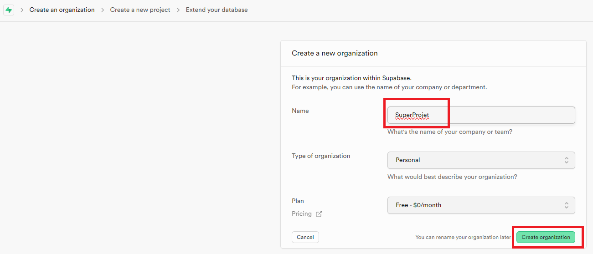
  </Column>
  <Column size="8">
    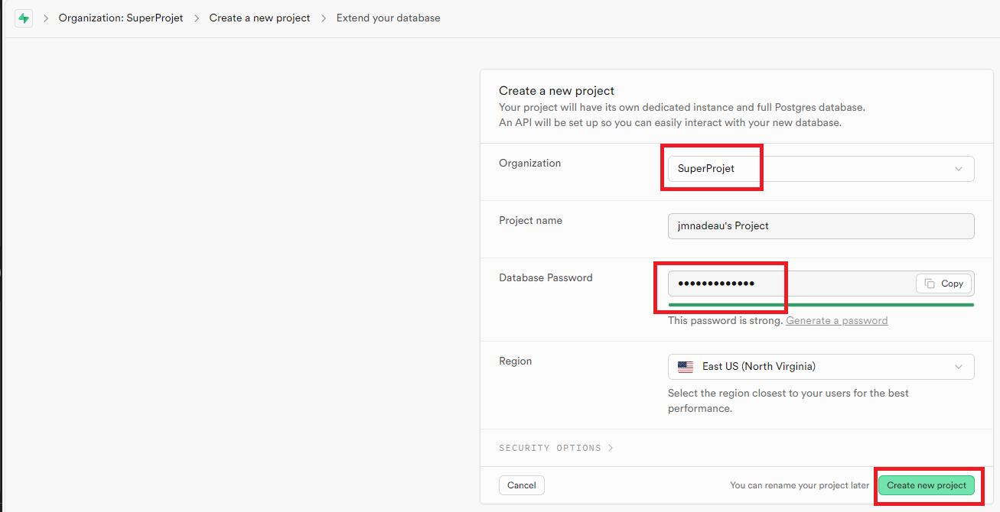
  </Column>
  <Column size="8">
    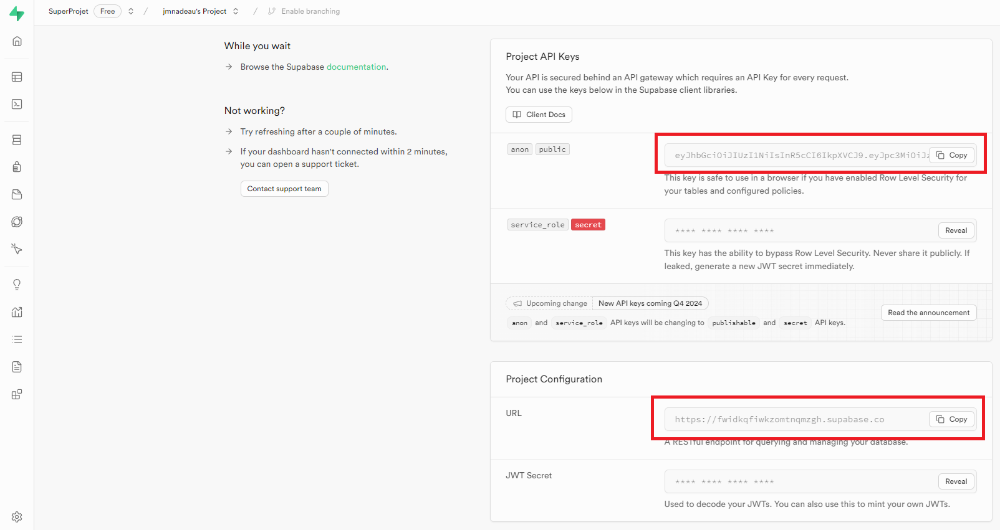
  </Column>
  <Column size="8">
    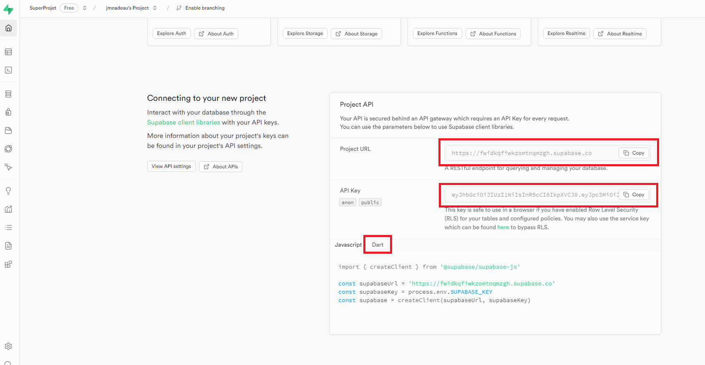
  </Column>
  <Column size="8">
    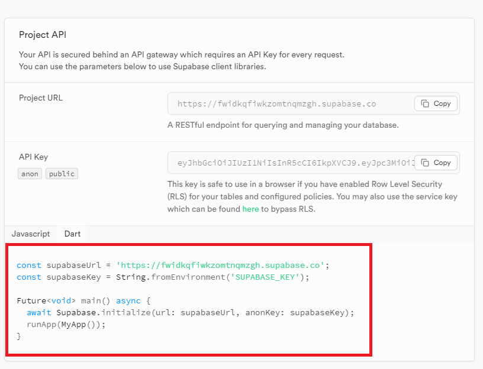
  </Column>
</Row>

## Supabase, configurer les droits d'accès

- suivre les captures d'écran

#### Ajouter les droits pour les buckets 

<Row>

  <Column size="8">
    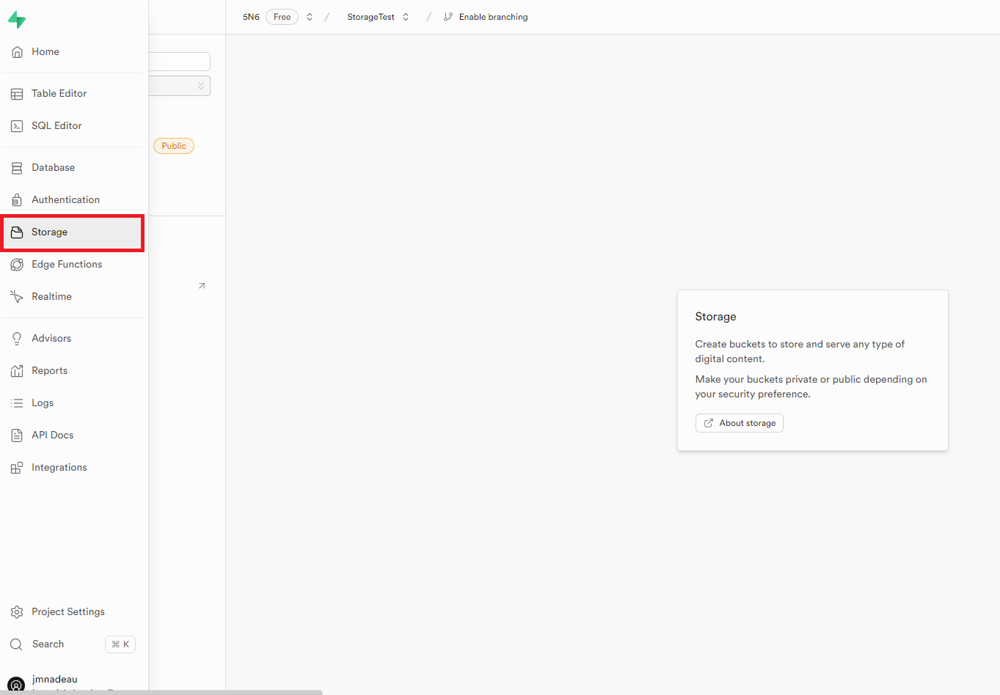
  </Column>
  <Column size="8">
    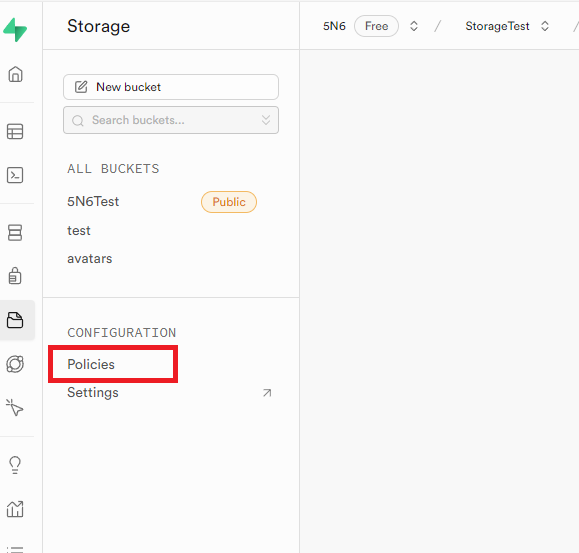
  </Column>
  <Column size="8">
    
  </Column>
  <Column size="8">
    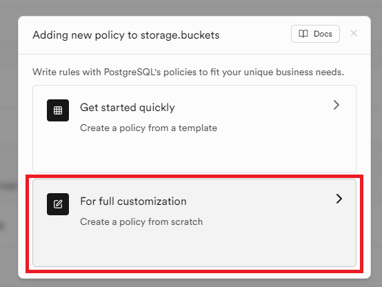
  </Column>
  <Column size="8">
    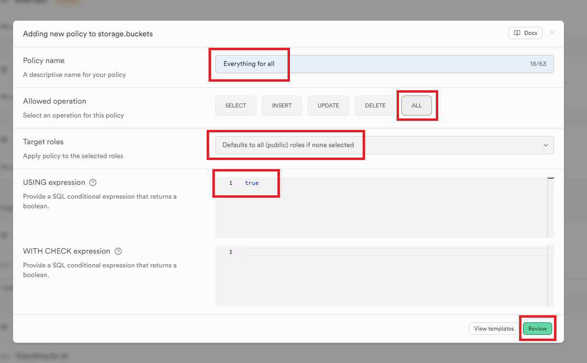
  </Column>
  <Column size="8">
    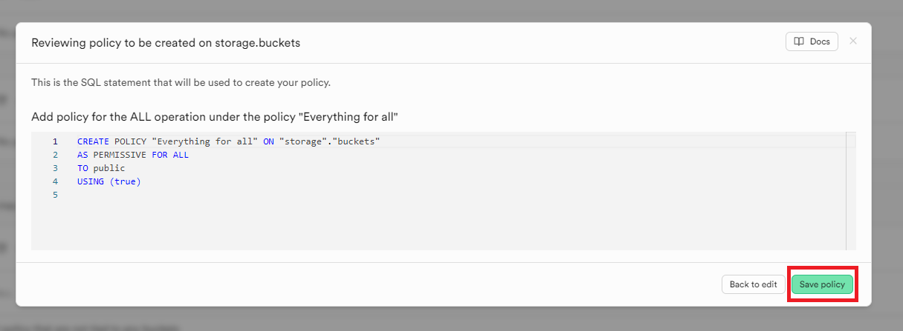
  </Column>
  
</Row>

#### Ajouter les droits pour les objets (images) dans les buckets

<Row>

  <Column size="8">
    
  </Column>
  <Column size="8">
    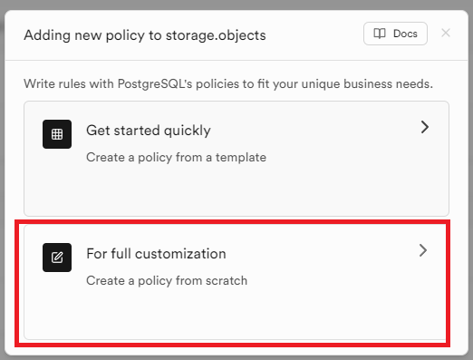
  </Column>
  <Column size="8">
    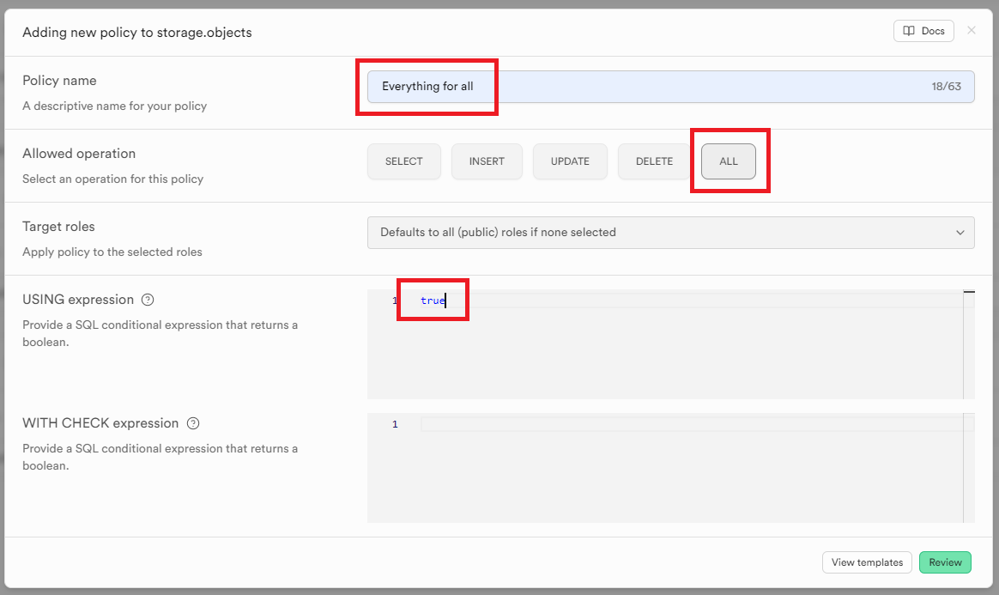
  </Column>
  
</Row>

## Supabase, créer un bucket public

Vous pouvez créer votre bucket de 2 façons
- avec du code
- avec l'interface de Supabase

#### Créer le bucket par le code

```dart
final supabase = Supabase.instance.client;

await supabase
        .storage
        .createBucket('le-nom-de-mon-bucket', BucketOptions(public: true));
```

#### Créer le bucket par l'interface

<Row>

  <Column size="8">
    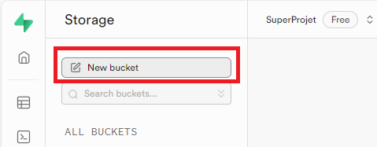
  </Column>
  <Column size="8">
    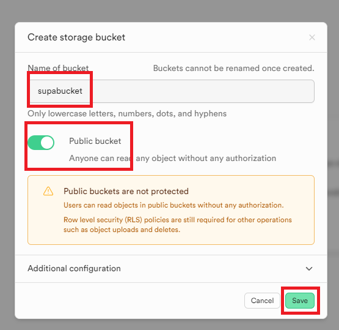
  </Column>
  
</Row>


## Ajouter une image

```dart
final supabase = Supabase.instance.client;

//TODO doc: https://supabase.com/docs/reference/dart/storage-from-upload
final String fullPath = await supabase
  .storage
  .from('le-nom-de-mon-bucket')
  .upload(
    //TODO Mettre un nom unique
    "nom-du-fichier",
    File("path-du-fichier")
  );
```

## Récupérer une image

```dart
final supabase = Supabase.instance.client;

//TODO doc: https://supabase.com/docs/reference/dart/storage-from-getpublicurl
string url = supabase
  .storage
  .from('le-nom-de-mon-bucket')
  // TODO le bucket doit être public pour qu'on puisse récupérer l'URL public
  .getPublicUrl("nom-du-fichier");
```

## Exemple de code

Vous pouvez regarder l'exemple de code **[supabase_storage](https://github.com/departement-info-cem/5N6-mobile-2/tree/main/code/supabase_storage)**.